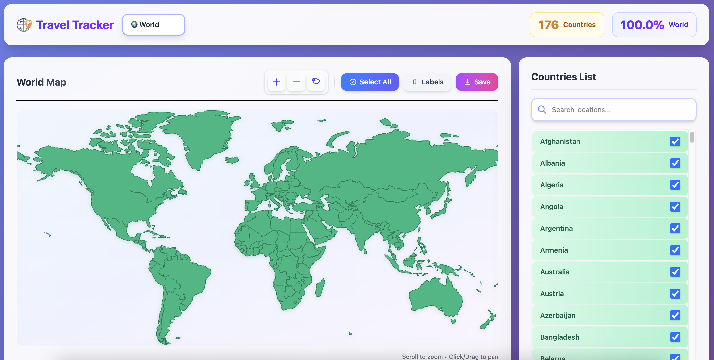
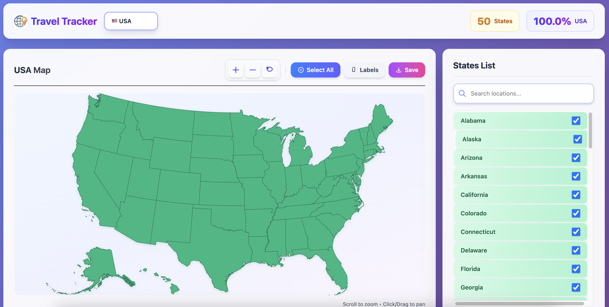
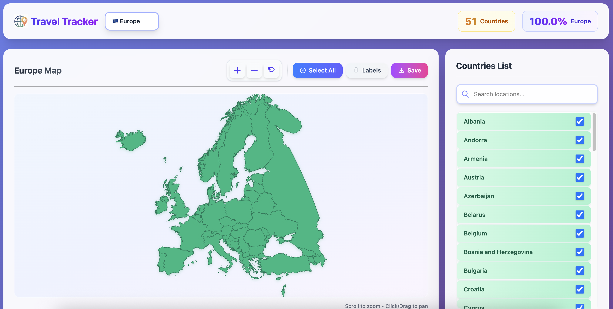
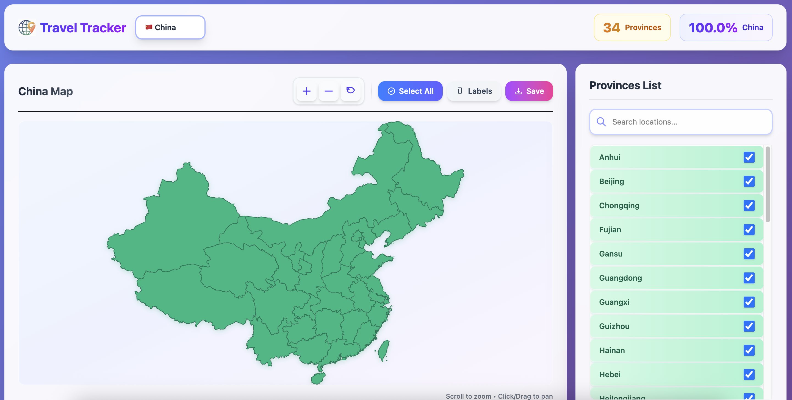
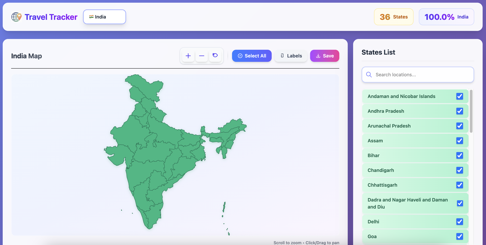
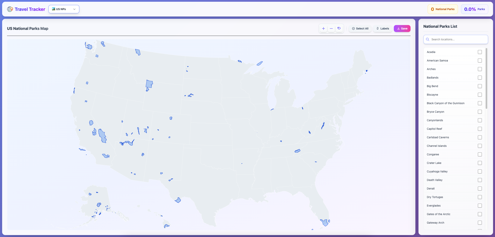

# Travel Tracker

An interactive world map application built with React, TypeScript, and D3.js for tracking visited countries, US states, European countries, Chinese provinces, Indian states, and US national parks.

[](https://changzhiai.github.io/TravelTracker)
[](LICENSE)


## 🎯 Live Maps

**👉 [View Live Application](https://changzhiai.github.io/TravelTracker)**

The application is automatically deployed via GitHub Actions on every push to the `main` branch.


## 📸 Screenshots

### Map Views

<div align="center">

#### 🌍 World Map


#### 🇺🇸 USA Map


#### 🇪🇺 Europe Map


#### 🇨🇳 China Map


#### 🇮🇳 India Map


#### 🏞️ US National Parks Map


</div>


## Features

- 🌍 **World Map View** - Track countries you've visited (~177 countries)
- 🇺🇸 **USA Map View** - Track US states you've visited (50 states)
- 🏞️ **US National Parks View** - Explore and track 63 US national parks
- 🇪🇺 **Europe Map View** - Track European countries you've visited
- 🇨🇳 **China Map View** - Track Chinese provinces you've visited
- 🇮🇳 **India Map View** - Track Indian states and union territories (36 total)
- 🎯 **Interactive Selection** - Click on map or list to select locations
- 🔍 **Search Functionality** - Quickly find countries/states/provinces
- 🏷️ **Labels** - Show labels for selected locations
- 🔍 **Zoom & Pan** - Interactive map navigation with smooth controls
- 💾 **Export** - Save high-quality PNG images (3x resolution)
- 📊 **Statistics** - View count and percentage of visited locations
- 📱 **Responsive Design** - Works beautifully on desktop and mobile
- 🎨 **Modern UI** - Glassmorphism design with gradient effects

## Tech Stack

- React 19
- TypeScript
- D3.js
- Tailwind CSS
- Vite

## Getting Started

### Prerequisites

- Node.js 20 or higher
- npm

### Installation

```bash
npm install
```

### Development

```bash
npm run dev
```

### Build

```bash
npm run build
```

## Deployment to GitHub Pages

This project is configured for GitHub Pages deployment.

### Automatic Deployment (Recommended)

1. Push your code to a GitHub repository
2. Go to repository Settings → Pages
3. Under "Source", select "GitHub Actions"
4. The workflow will automatically deploy on every push to `main` branch

### Manual Deployment

1. Install gh-pages: `npm install --save-dev gh-pages`
2. Update the `homepage` field in `package.json` with your GitHub username
3. Run: `npm run deploy`


> **Note**: These screenshots show the different map views available in the application. For the full interactive experience, visit the [live demo](#-live-demo).


## ⚠️ Data Accuracy Note

Some data may not be completely accurate. For example: there are generally recognized to be **195 countries** in the world (193 UN member states + 2 observer states), but this application includes **~176 countries/territories** based on the Natural Earth dataset used. The map data is sourced from publicly available GeoJSON/TopoJSON datasets, and the exact count may vary depending on the data source and how territories are classified. This is common across different mapping applications and datasets.


## 📧 Contact

For questions, suggestions, or feedback, please contact: **changzhiai@gmail.com**