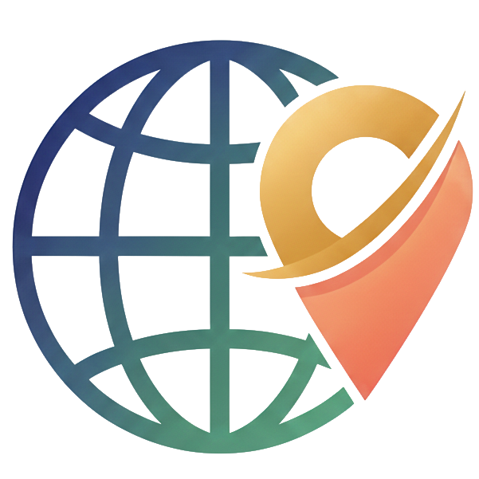
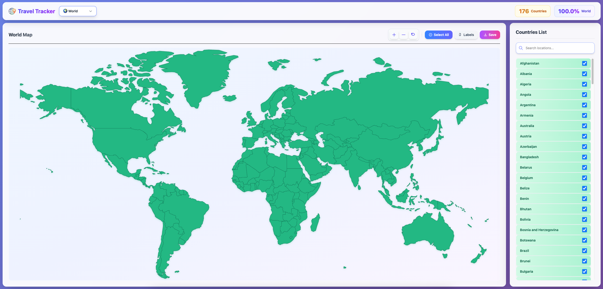
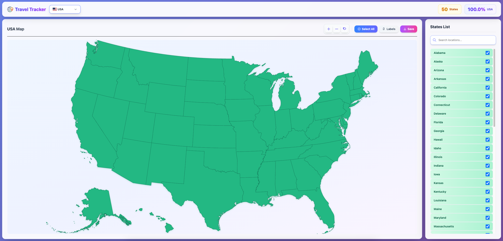
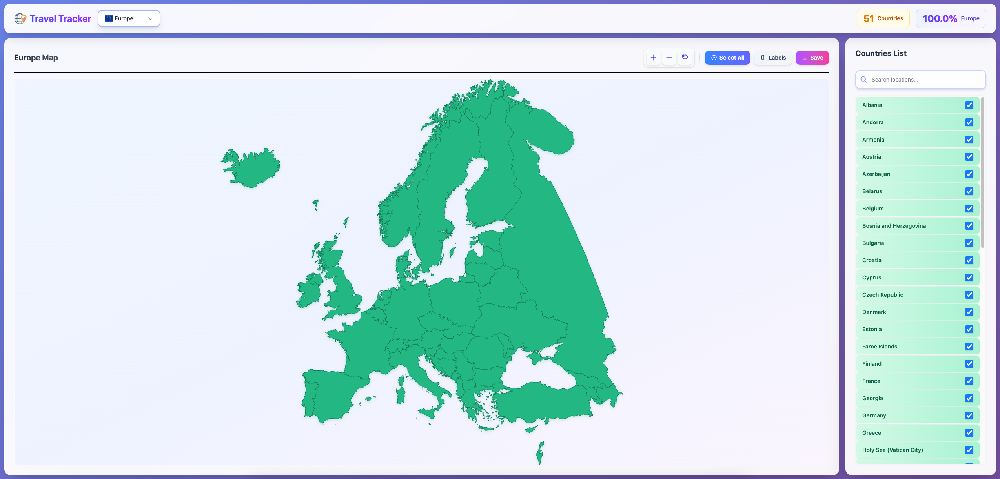
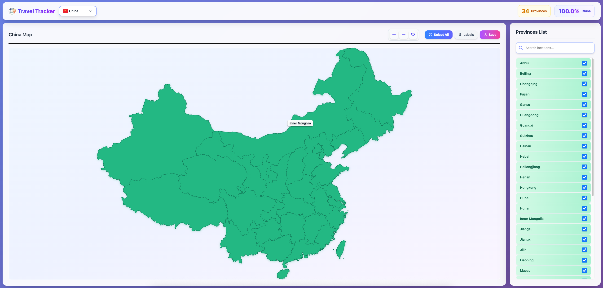
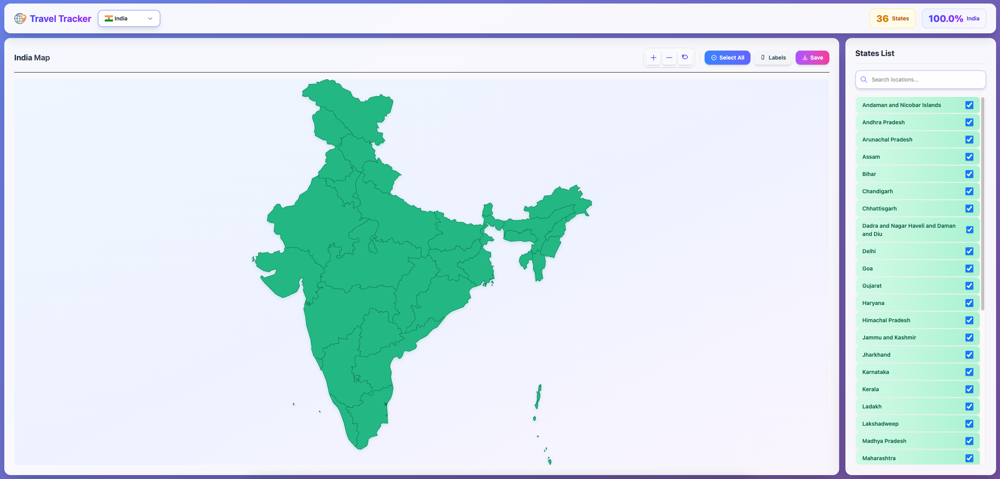
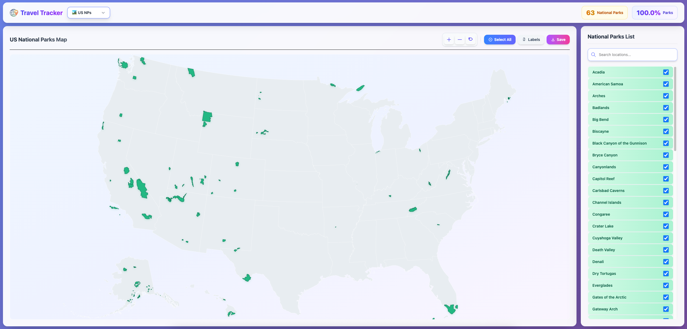

# Travel Tracker

An interactive map application that helps you track your travels. It can give you total numbers and percentages of how many countries in the world, US states, European countries, Chinese provinces, Indian states, and US national parks you have visited — with totals, percentages, and exportable map images. It also allows you to login and save your travel data to the cloud, and export, share, or download the maps.

## Try it

**Web:** [travel-tracker.org](https://travel-tracker.org/)

**Mobile:** Download from the App Store or Google Play by scanning the QR code below:

## Features

- **World Map** — 240+ countries & territories
- **USA** — all 50 states
- **US National Parks** — 63 parks
- **Europe** — European countries
- **China** — provinces & regions
- **India** — 36 states and union territories
- Click-to-select on map or from the sidebar list
- Search by common or formal name (e.g. "Republic of Maldives", "Kingdom of Bahrain")
- Zoom, pan, labels
- Export as high-res PNG (3x)
- Stats: count and percentage of visited locations
- Google & Apple login, cloud sync
- Works on desktop and mobile

## Screenshots

#### 🌍 World Map

#### 🇺🇸 USA Map

#### 🇪🇺 Europe Map

#### 🇨🇳 China Map

#### 🇮🇳 India Map

#### 🏞️ US National Parks Map

## Docs

- [Tech Stack](docs/TECH_STACK.md)
- [Deployment (AWS)](docs/DEPLOY_AWS.md)
- [Mobile Builds](docs/DEPLOY_MOBILE.md)
- [Auth Setup](docs/AUTH_CONFIG.md)

## Data Accuracy

The world map uses the 50m Natural Earth dataset — 240+ countries and territories, all 195 UN member/observer states, including island states and microstates (Maldives, Bahrain, Singapore, Malta, Monaco, Vatican City, Seychelles, Mauritius, etc.).

## Contact

For questions, suggestions, or feedback, please contact maintainer: **changzhiai@gmail.com**
